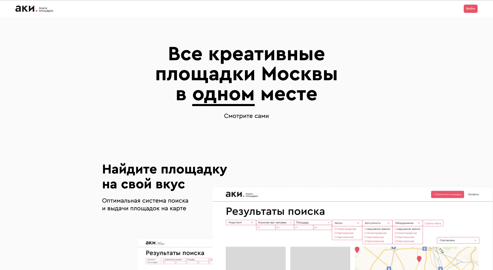
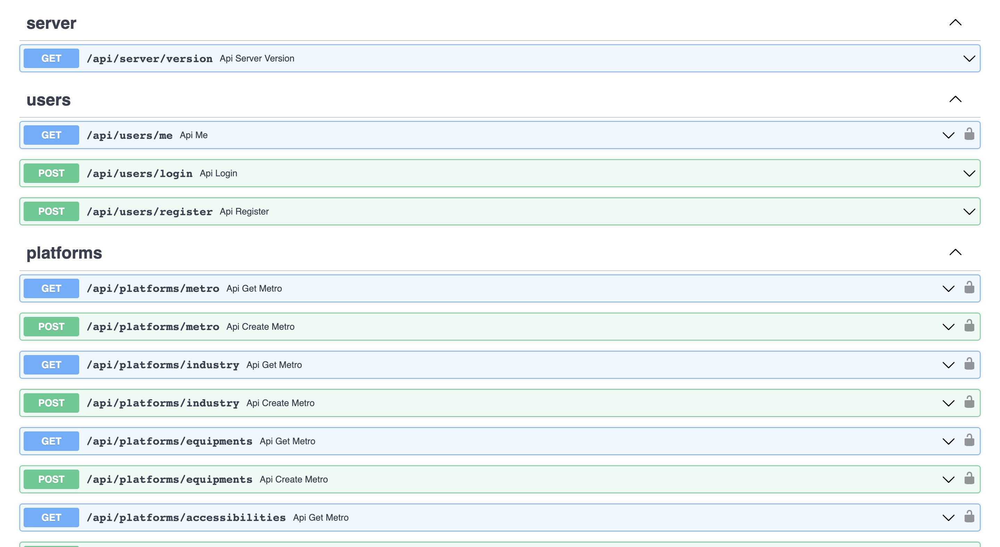

## Пооект хакатона "Лидеры цифровой информации" в треке "Агрегатор площадок и услуг креативных индустрий Москвы"

### Экраны сервиса
Все макеты сервиса представлены в Figma.
[Ссылка на Figma](https://clck.ru/34YEPk)

### Прототип проекта
[Ссылка на прототип](http://178.170.197.108)  
Далее несколько экранов проекта

#### Лендинг
  

#### Карточка платформы


### Сопроводительная документация
[Ссылка на ЯДиск](https://disk.yandex.ru/d/KsDHiyslvvE3Vg)

### Презентация решения
[Ссылка на ЯДиск](https://disk.yandex.ru/i/id8RB2CEqy72ZQ)

### Серверая часть
Серверая часть написана на `Python` с использованием фреймворка `FastAPI` и базы данных
`PostgreSQL`.
Для сборки серверной части использовать следующие команды:
```
cd backend
docker compose up --build -d
```
Благодаря использованию фреймворка `FastAPI` автоматически собирается документация
под разработанные методы. [Ссылка на документацию](http://178.170.197.108/api/docs)


### Клиентская часть
Клиентская часть разработана на Vue.js с использованием
дополнительных библиотек, таких как `multiselect` и `leaflet`.

Для сборки клиентской части использовать следующие команды:
```
cd frontend
npm install
npm run build
```

### Авторство
dorateam, 2023

